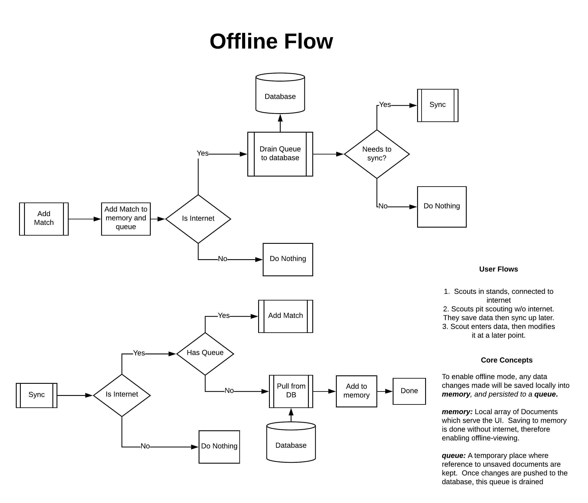

# Phoenix Scout

> An intuitive and powerful scouting solution for FRC robotics teams. A video demo can be found (here)[https://youtu.be/swM9t0lOC2w]

## Background

The purpose of Phoenix Scout is to enable quick scouting entry and consumption during a robotics competition.

FIRST robotics is an international high-school robotics organization where each year, a new game is announced and teams are given 6 weeks to design, manufacture, and program a robot to compete at regional events. Each event brings together 40-60 different teams, in which they compete in randomly assigned qualification matches for a spot in in the finals.

Each match is designed such that 3 robots play against 3 other robots. It becomes imperative that a team has readily available statistics on the abilities of every robot on the field. This can help enable a team to devise a successful strategy.

The main objectives for the Phoenix Scout system are:

1.  Easy Data Entry

    > A student is assigned to collect performance data on a robot, where they gather relevant data on the robot's performance. Many solutions in the past have primarily used either paper forms, a centralized excel sheet to process the data, or a combination thereof. This often involves a lot of manual work to centralize all this data, and even more consideration to keep all this data in sync. This can be fully automated, as this project sets out to accomplish.

2.  Immediate Data Views

    > Previous solutions have always required some element of manual work to process raw data and put this into the hands of those who need it. The solution presented here seeks to eliminate this completely by hosting a centralized backend API service which becomes the source of truth.

3.  Offline-first access
    > There are many unique constraints that the physical venue poses. Often, due to dense concentration of people at these events, the network service may be limited. Therefore, a requirement of a fully online system requires that no data is lost if network service is unavailable, and that changes are synced once the device comes back online.

## Install

This application consists of a frontend, backend, and database layer. This project utilizes docker to manage each process.

1. Duplicate and rename the sample `.env-example` file to `.env`.
2. Install docker and docker-compose for your operating system.
3. Run the following command

```sh
> docker-compose up -d
```

4. Visit localhost:3000 in the web browser.

## Overall Software Architecture

### Technologies Used

- React (utilizes React Hooks)
- MongoDB
- Node.js backend (Express framework)

### Requirements

### Offline Architecture

The central requirement for this application is to enable seamless data entry/display irrespective of one's network connectivity -- If connection to the server is broken, one can still enter new data and see changes reflected immediately.

Immediate data access drives the need to hold all data in memory. With data cached in memory, data access is possible irrespective of network connectivity. The problem to be solved is how to reconcile a possibly modified local cache of data with possibly modified data from the server.

This is the problem of concurrency in a multi-user application, where applications such as Google Drive seek to reconcile a stream of data changes all happening at once.

For the purposes of this application, it was determined that updates do not have to happen in real-time. For this reason, the proposed solution implemented in this application is to:

1. Have data held in memory as the source of truth. Any updates to a preexisting document changes this in-memory data, and additionally adds the unique document key to a queue.
2. When data is to be synced with the server, this queue is used to find documents that were changed locally, pushing the newest state of these documents to the server before draining this queue.

This solution meets the requirement that the application provides a way to add/update existing data in an offline-first environment.

This solution was implemented as follows:

1. Client ([Link to Custom Hook](frontend/src/store/usePersistReducer.tsx))

   - A custom React hook was written which manages the offline flow. A diagram of the hook architecture is shown below:

   - 

2. Server ([Link to Controller](server/src/controllers/matches.ts))
   - The solution described requires that the backend exposes a GET/POST REST endpoint. The GET endpoint returns a dump of all data, where the POST endpoint accepts full document objects. New documents not already present in the database will be inserted into the database, while if a document ID is passed inside of the object, then MongoDB will try to modify an existing document accordingly.
     <!-- 
     The Node.js server is built with Composabilitity and Modularity in mind. The overarching goal is to design a server as a composition of logically separated modules. The rest of this readme will be focused around explaining the rationale for the separation of concerns chosen.

## General Module Architecture

As one of the main priorities is designing with Modularity in mind, a standardized module structure was deemed necessary.

Inspiration was taken from Angular's Style of Dependency Injection, whereby a module's specific implementation should be abstracted away from any of it's consumers. More details about can be found at [Angular.io's Docs](https://goo.gl/8sL2u5). Research led to three different ways do modularize a javascript codebase without typescript support. The three options ar summarized by Krzysztof Sztompka in this [Stack Overflow article](https://goo.gl/9N6Hpm).

Due to cleanliness, a modularization system (built on middlewares) was chosen to work as follows.

```javascript
// Module.js
module.exports = function(app) {
  // The app parameter is a representation of the Express.js app, and thus any server settings
  // can be accessed in this Module Middleware.

  // This return function with these parameters represents an Express.js middleware.
  // Used with app.use() in the consumer of this Module Middleware
  return function(req, res, next) {
    // Perform Middleware functions here.  Call next() to move onto subsequent middlewares/routes.
    next()
  }
}
```

Once the module is created, it is then incorporated into the top-level application in the following manner.

```javascript
var moduleName = require("<./path/to/module>")(app)
app.use(moduleName)
```

That's it! With one line of code, the module is incorporated into the main application. This method of modularity proved to be the cleanest implementation, and thus is the standard for use in this application.

## Routing Module

The core functionality of an API backend is to listen to routes and serve corresponding API responses. Two primary areas of concern are important to the routing layer:

1.  Control of route endpoint names
2.  Implementation of correct route behavior

While most Express.js tutorials combine these two listed goals into one file, a cleaner implementation was suggested at [Code Mentor](https://goo.gl/eB7dmZ), which splits these into two further modularized concepts.

The Routing module is designed as follows:

```javascript
// user.route.js
module.exports = function(app) {
  app.route("/login").post(usersController.authenticateUser)
  app.route("/register").post(usersController.registerUser)
  app.route("/me").post(auth, usersController.me)
}
```

As you can see, the top level of this module provides a very clean implementation of the routing logic, with specific functional implementation given over to the controller. This provides for a very clean and intuitive routing implementation. It is then the responsibility of the controller to handle database calls and forming the API response. One route module is created per resource entity, as dictated by business logic (ie: Users, Parts, Machines, etc...). One thing to note: this routing logic does not adhere strictly to the above mentioned Module Middleware format (ie: returning `function(req, res, next)`, because routes are the last thing called in the request process. Future implementations may revert to the aforementioned standard so as to allow for logging processes after the API response has been sent.

## MongoDB Module

### Background

Integral to the functioning of this application is a persistant database. When deciding on a way to persist data, there are many choices to be made. The highest-level choice is between Relational databases(RDBs) and Non-relational databases. While this is a large topic in it's own right, two primary ways to start the choice process is by modeling the data interaction via an [Entity-Relationship model(ER)](https://en.wikipedia.org/wiki/Entity%E2%80%93relationship_model). This helps to arrive at a solid understanding of the data being stored, and is a great place to start. Below is a model of the proposed ER diagram for this application (This project is still in development, so not all functionality is instituted).


While an ER model is formally used for relational databases, due to connections in the ER diagram translating directly to primary/foreign keys in the RDBs, it is also very convenient even if a non-relational database is chosen. This is because, there are two ways for a Non-relational database to be implemented. In fact, a proper implementation of a non-relational database can have both types of implementations: Embedded vs. Reference. A full coverage of the advantages/tradeoffs of each can be found in this [Microsoft Talk](https://goo.gl/grasnP).

In my project, I made the decision to use the Non-relational database known as MongoDb. My choice of using MongoDb is for the added flexibility that MongoDb provides a developer in data-modeling. There is a big misconception that MongoDb is `Schema-less`. While it is true that, at the database layer, MongoDb does not enforce a particular schema, it is a best-practice for a developer to enforce a schema at the application-layer. This ensures consistency across documents in a collection.

To achieve this, a widely popular Object Document Modeling npm package known as [Mongoose](http://mongoosejs.com/) is used.

### MongoDb Module Implementation

Again, the standardized Module implementation is used, as detailed in the Module Architecture Section. Within this module, are all the database connection-related logic, which is all handled by Mongoose. Mongoose is implemented as a singleton, meaning that the package does not place a restriction on placing all MongoDB-related logic (ie: Schema and Model definitions) in the same middleware. Therefore it was chosen to declare the Mongoose Schemas and Models within their respective controllers (ie: user.controller.js contains a `require('./path/to/mongoose-model')`.

## Future Endeavors

- Currently, User Authentication works using JWTs. If there is a need to extend functionality beyond MongoDB support, Passport.js may be used for User Auth.
- Socket.io Session Handling to support real-time chatroom functionality.
- AWS S3 storage for all media/pdf/picture uploads.

# Associated Links

https://12factor.net/config
https://stackoverflow.com/questions/18880142/access-app-variable-inside-of-expressjs-connectjs-middleware
https://expressjs.com/en/guide/writing-middleware.html
https://stackoverflow.com/questions/34468395/express-call-a-middleware-from-another-middleware

https://www.npmjs.com/package/performant-array-to-tree
https://stackoverflow.com/questions/22367711/construct-hierarchy-tree-from-flat-list-with-parent-field
https://stackoverflow.com/questions/6232753/convert-delimited-string-into-hierarchical-json-with-jquery
https://gist.github.com/lineus/99c9e574fdefc2c84b932b6e949c7c8e

https://docs.mongodb.com/ecosystem/use-cases/storing-comments/
http://blog.ijasoneverett.com/2013/11/getting-started-with-mongoose-and-node-js-a-sample-comments-system/
https://www.mongodb.com/blog/post/thinking-documents-part-1?jmp=docs&_ga=2.218000982.134088568.1521985698-1047311511.1521985698

https://docs.mongodb.com/ecosystem/use-cases/storing-comments/
https://stackoverflow.com/questions/46019926/updating-slug-with-mongoose-presave

https://stackoverflow.com/questions/3923015/remove-leading-comma-from-a-string

This is how I set up my JWT auth system:
https://medium.freecodecamp.org/securing-node-js-restful-apis-with-json-web-tokens-9f811a92bb52

This is the Team 4 Scouting solution [Create React App](https://github.com/facebook/create-react-app).

## Helpful Links

setting up frontend with webpack: https://medium.com/@atingenkay/webpack-4-react-with-typescript-996eb78ff348

setting up backend, and getting shared modules to work:
http://engineering.conversantmedia.com/technology/2019/10/01/typescript-hot-reload/

https://tylermcginnis.com/react-router-cannot-get-url-refresh/

## Available Scripts

In the project directory, you can run:

### `yarn start`

Runs the app in the development mode.<br />
Open [http://localhost:3000](http://localhost:3000) to view it in the browser.

The page will reload if you make edits.<br />
You will also see any lint errors in the console.

### `yarn test`

Launches the test runner in the interactive watch mode.<br />
See the section about [running tests](https://facebook.github.io/create-react-app/docs/running-tests) for more information.

### `yarn build`

Builds the app for production to the `build` folder.<br />
It correctly bundles React in production mode and optimizes the build for the best performance.

The build is minified and the filenames include the hashes.<br />
Your app is ready to be deployed!

See the section about [deployment](https://facebook.github.io/create-react-app/docs/deployment) for more information.

### `yarn eject`

**Note: this is a one-way operation. Once you `eject`, you can’t go back!**

If you aren’t satisfied with the build tool and configuration choices, you can `eject` at any time. This command will remove the single build dependency from your project.

Instead, it will copy all the configuration files and the transitive dependencies (Webpack, Babel, ESLint, etc) right into your project so you have full control over them. All of the commands except `eject` will still work, but they will point to the copied scripts so you can tweak them. At this point you’re on your own.

You don’t have to ever use `eject`. The curated feature set is suitable for small and middle deployments, and you shouldn’t feel obligated to use this feature. However we understand that this tool wouldn’t be useful if you couldn’t customize it when you are ready for it.

## Learn More

You can learn more in the [Create React App documentation](https://facebook.github.io/create-react-app/docs/getting-started).

To learn React, check out the [React documentation](https://reactjs.org/). -->
